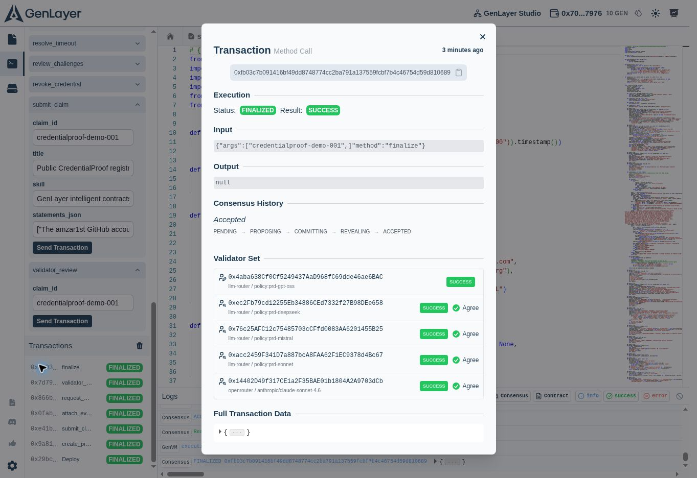

# Live verification — 3 October 2026

CredentialProof was deployed to GenLayer **Studionet**, using Studio's built-in wallet and faucet. Every write ran in **Normal (Full Consensus)** mode. No browser-wallet connection or private-key export was used.

The claim `credentialproof-demo-001` completed profile creation, submission, evidence attachment, verification request, AI validator review, the 120-second challenge window, and finalization. Its finalized state is **ISSUED**, with credential **cp-credentialproof-demo-001**, verdict **VERIFIED**, and active profile reputation `{ "verified": 1, "partial": 0 }`.

The supported scope is deliberately narrow: the amzar1st GitHub account published the CredentialProof Python contract containing profile creation, evidence review and credential finalization methods. This does not certify personal authorship, employment or professional licensing.

Validators fetched an exact account-to-wallet attestation and commit-pinned public contract source, verified its SHA-256, and independently assessed the statement. The review required two leader rotations before majority agreement. Consensus is therefore not described as unanimous. Finalization succeeded after the deadline; no challenge was submitted to this live claim.

[Machine-readable evidence](live-verification.json) includes the exact finalized claim, profile, seven transaction hashes and sanitized receipts captured from **LATEST_FINAL**. Studio can reset this development network.

## Validation scope

- 25 contract behavioral tests passed against gltest's pinned GenLayer SDK v0.2.16, using mocked external web and LLM inputs.
- Four frontend receipt tests cover finality, execution failures and Studio's idle-validator cancellation after successful quorum.
- Production Vite build passed.
- Live public-source AI review and credential issuance succeeded. Challenge, partial, conflicting and rejected branches were tested with mocks, not claimed as additional live demonstrations.
- Browser visual interaction checks and WebMCP invocation checks were unavailable in this execution environment. WebMCP tools are feature-detected read-only helpers.
- The deployed app is owner-private. Reads query finalized on-chain state; writes can be prepared for Studio without connecting a browser wallet.
